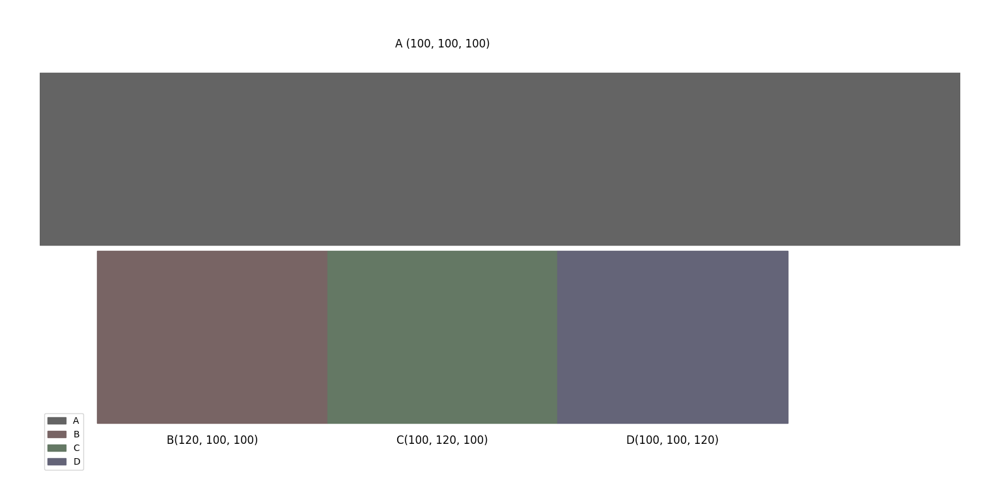
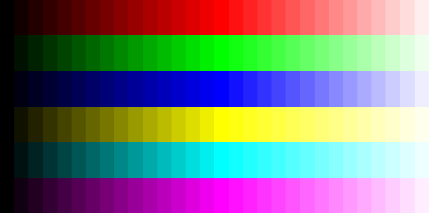
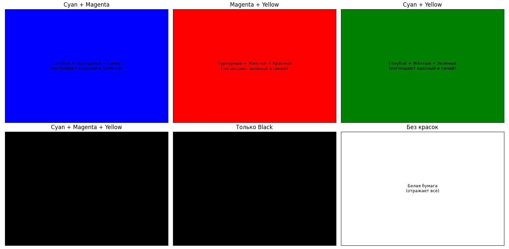

## Сравнение цветовых пространств

По сути копирую разный материал со статей. Я считаю, что мой пересказ лучше.

* [О цветовых пространствах](https://habr.com/ru/articles/181580/)

Также есть статья, которую я не решился прочитать, потому что судя по объёму я бы познал вселенную 
(следовательно пересказывать её не буду, но уверен, что она содержательная и интересная)

* [Цвет: от шестнадцатеричных кодов до глаза](https://habr.com/ru/articles/353582/)

### Цветовое пространство

Цветовое пространство — это модель представления цвета, основанная на использовании цветовых координат. 
Простыми словами, это палитра разных оттенков, где каждый цвет имеет определённые координаты, как точка на карте.

### RGB

RGB — аддитивная (цвета смешиваются) цветовая модель, основанная на смешении света. 
Название происходит от инициалов трёх базовых цветов

У системы есть большой минус. **Цвета A(100, 100, 100) и B(120, 100, 100)** отличаются друг от друга **на 20**.
Это можно считать по расстоянию Евклида, но в целом тут без него всё понятно. Цвет C(100, 120, 100) по идее также
удалён от цвета A, но при этом разница между (A и B) и (A и C) воспринимается человеком не как равная.

Также можно "ощутить" неравномерность восприятия цвета в RGB с помощью градиентов цветов (пример в 16-ричной системе)
* для красного - цвета (0, 0, 0) -> (1, 0, 0) -> (2, 0, 0) -> ... -> (e, 0, 0) -> (f, 0, 0) -> (f, 1, 1) -> (f, e, e) -> (f, f, f)
* для зеленого - цвета (0, 0, 0) -> (0, 1, 0) -> ... -> (0, f, 0) -> (1, f, 1) -> ...
* для жёлтого -  цвета (0, 0, 0) -> (1, 1, 0) -> (2, 2, 0) -> ... -> (f, f, 0) -> (f, f, 1) -> ...

* Яркость цветов увеличивается неравномерно: чем оттенок ближе к белому цвету, тем изменение яркости меньше
* Яркость разных цветов различается: синий намного темнее остальных
* Насыщенность также неравномерна: синий и красный выглядят «ненасыщенными» в правой части градиента
* Особенна заметно почти полное отсутствие разницы (а на числах она есть) в центре каждого цвета

### CMY и CMYK (чисто сплинфакт)

Субтрактивная цветовая модель — это модель смешивания цветов, в которой воспроизведение цвета происходит путём вычитания 
основных цветов из белого цвета. Например, в модели CMY (от англ. cyan — голубой, magenta — пурпурный, yellow — жёлтый) 
жёлтый краситель вычитает из отражённого белого света синий, голубой — красный, а пурпурный — зелёный.

По сути в RGB цвета смешиваются (аддитивность):
* желтый - (f, f, 0) 
* голубой - (0, f, f)
* пурпурный - (f, 0, f)

В CMY цвета вычитаются из белого (субтрактивность):
* белый - жёлтый = синий
* белый - голубой = красный
* (f, f, f) - (f, 0, f) = (0, f, 0)

Применяется это для печати на белой бумаге (на цветной всё сложнее). Там это немного интереснее, разбор на изображении

CMYK - это то же самое, что и CMY, но с добавлением черного цвета отдельно. Это нужно для экономии краски в принтере.
Также чёрный "чернее", чем смесь cyan+magenta+yellow

### CIE 1931

Эту цветовую модель разработала в 1931 году Международная комиссия по освещению (Commission internationale 
de l'éclairage). Её главная цель — объективно описать цвет на основе особенностей человеческого восприятия.

Было проведено множество интереснейших экспериментов, почитать о них можно в статье

[Цветовая вычислительная фотография. Часть 2: Стандарты CIE 1931](https://habr.com/ru/companies/airi/articles/916116/)

Я это прочитал, если честно не до конца переварил математическую часть, почему красный цвет имеет отрицательную часть
волны, не вникал в линейные преобразования, необходимые для того, чтобы избавиться от отрицательных чисел, но
в целом какое-то общее представление получил.

Я пишу readme постепенно, по ходу того, как углубляюсь в инфу, но сейчас мне кажется, что для полного понимания
этого раздела мне придется немного утонуть, так что опущу этот момент. Я хочу ещё успеть написать модуль

Что важно уточнить, данная модель показывает спектр цветов, которые воспринимает человек, но с её помощью нельзя вычислить
расстояния между цветами

### Модель CIELAB (1970)

Модель придумали для того, чтобы можно было находить расстояния между цветами.

Система также задана тремя координатами:
- L - значение светлоты (от 0 до 100)
- A - позиция между зелёным и пурпурным 
- B - позиция между синим и жёлтым

В статьях указаны формулы для перехода от CIE XYZ к CIELAB, но на них не буду заострять внимание - все равно не понял

### HSLuv

Интересная альтернатива для CIELAB. Можно потом отдельно будет сравнивать, тестировать, пока понимаю, что это надолго 
* [HSLuv — удобное цветовое пространство для разработчиков](https://habr.com/ru/companies/timeweb/articles/646051/)
